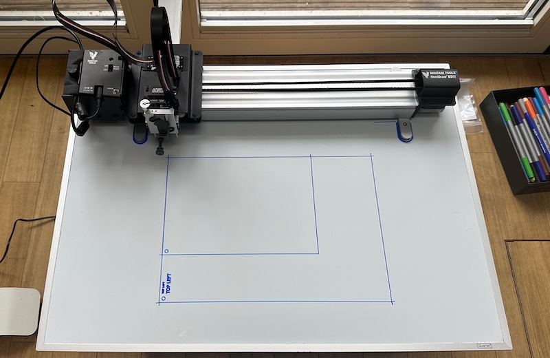
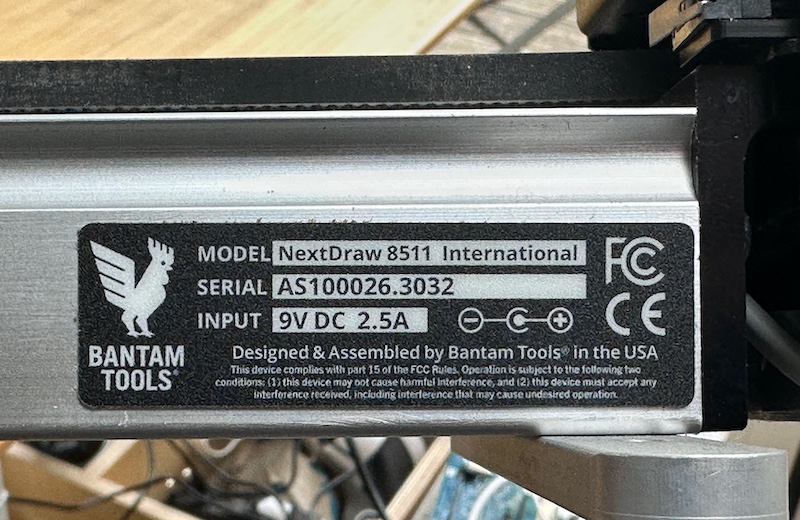

# Plotter repository

A collection of pen plotter files created using processing, p5.js, python and inkscape.

## Generative Art Portfolio

This repository contains projects designed for the Bantam NextDraw pen plotter. I tend to work with A5 card by default. The portfolio is built using HTML and Processing (`p5.js`) to generate SVG files.

View the digital portfolio at [https://djdunc.github.io/plotter/](https://djdunc.github.io/plotter/)

Initial info at [http://www.iot.io/blog/2025/01/18/plotter.html](http://www.iot.io/blog/2025/01/18/plotter.html)

Nextdraw folder has documentation and examples of how to use the NextDraw plotter plus some early plots.

### Projects Structure
- `projects/`: The generative sketches
- `assets/`: Shared libraries such as `p5.min.js` and CSS.
- `index.html`: The main gallery page.
- `gallery.html`: The gallery of raw SVG images.

### Legacy work 

p5 folder has some initial experiments with p5.

Processing folder has some initial processing sketches.

## Printing process reminder

Assumes NextDraw is connected and configured with the correct drivers and inkscape software. See Nextdraw setup guide.

1. Create .svg file
2. Open svg in inkscape and check the page size is set to A5 portrait
3. Open Inkscape > Extensions > Bantam Tools NextDraw
4. Check pen height in the Setup tab. Click apply to check the pen up / down.
5. Back to plot tab and click plot. 

### Setting pen height

Noted "thudding" of pen on paper when pen height is set too low. Use the pen up / down on Bantam tools to check the force that it is hitting a test piece of paper. Wants to touch but not thud.

### Guides

### Reminders

**A box is being printed around the artwork but I cannot see that box in my sketch?**
In p5.js, calling background(255) on an SVG canvas explicitly translates into creating an SVG <rect> that spans the full width and height of the canvas, filled with the color white (rgb(255, 255, 255)). While that bounding box is completely invisible on your white computer screen, standard SVG tools (and the NextDraw Inkscape extension) ignore colors—they purely see mathematical vector paths. When Inkscape parses the exported SVG, it sees that giant rectangular path and dutifully sends the pen plotter around the perimeter of the paper before drawing the art. The Fix: never call background(...) when dealing with physical plot files if you just want blank paper. Instead, use clear(), which wipes the digital canvas transparent without generating any SVG elements.

### Serial Number

